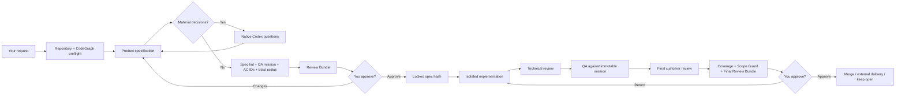

<div align="center">

# SpecRail

### Human-approved, evidence-backed software delivery for Codex

Turn a natural-language request into a locked specification, focused implementation, real evidence, independent review, and an explicit delivery decision — without managing a board or memorizing commands.

[](https://www.npmjs.com/package/@saulmarti/specrail)
[](https://nodejs.org/)
[](LICENSE)

</div>

> **Formerly AI Flow.** The `ai-flow` command and existing `.ai/` projects remain compatible.

## Why SpecRail?

Coding agents are fast at producing code. The expensive failures happen around the code:

- implementing before the requirement is clear;
- silently changing the approved scope;
- reviewing a UI proposal that does not show the requested section;
- claiming success without real screenshots, responses, logs, or tests;
- retrying the same failure indefinitely;
- losing task state when a chat closes;
- letting two sessions edit the same task;
- approving a result from fragmented evidence.

SpecRail adds **rails**, not another project-management system. Markdown remains the source of truth, Codex remains the agent, and deterministic gates protect the delivery.

## 60-second setup

### Requirements

- macOS or Linux
- Node.js 22+
- Codex Desktop or another compatible Codex surface
- [CodeGraph](https://github.com/colbymchenry/codegraph) available as a CLI and configured as `codegraph serve --mcp`
- For UI work: compatible [Taste Skills](https://github.com/Leonxlnx/taste-skill)
- Optional: the Codex Visualize plugin/skill for native interactive review surfaces

### Install the beta

```bash
npm install -g @saulmarti/specrail@beta
specrail install
```

The current public channel is `beta`; stable releases will later use the default `latest` tag.

The npm package is **`@saulmarti/specrail`**. The installed CLI command remains **`specrail`**; npm package scopes do not become part of executable names. The legacy `ai-flow` executable remains available as a compatibility alias.

To run it without a global install, use the explicit package form:

```bash
npx --package=@saulmarti/specrail@beta specrail install
```


Restart Codex Desktop. Open a repository in Codex and ask naturally:

```text
Redesign the homepage hero so the primary action is clearer on mobile.
```

```text
Corrige el bug que duplica favoritos al pulsar dos veces.
```

```text
Design the architecture for moving search indexing out of the request path.
```

You do not need to create tasks manually, mention SpecRail, invoke a skill, or remember an ID.

### Verify or repair the installation

```bash
specrail doctor
specrail doctor --fix              # preview safe repairs
# after the native approval gate:
specrail doctor --fix --apply safe
```

`doctor --fix` never silently installs Node, Git, CodeGraph, plugins, or rewrites an unknown MCP schema. See [`docs/DOCTOR.md`](docs/DOCTOR.md).

SpecRail maintains CodeGraph deterministically before agent reasoning:

```text
codegraph init PROJECT --index       # first use
codegraph sync PROJECT               # normal refresh
codegraph index PROJECT --force --quiet  # recovery
codegraph status PROJECT             # verified readiness
```

## What happens after a request



The workflow adapts by surface, size, and risk. A small copy fix does not receive the same verification burden as a critical migration.

## A concrete UI example

You ask:

```text
Fix the Home Spotlight heading. It is too dominant on mobile.
```

SpecRail requires Codex to:

1. identify the exact route and section;
2. launch the real application;
3. capture the focused section, not the top of the page;
4. select the appropriate Taste Skills by their installed frontmatter names;
5. use Image Gen for the visual proposal when design exploration is warranted;
6. review the proposal for target mismatch, overflow, clipping, overlap, readability, and design-system consistency;
7. show the specification, before image, design brief, proposal, and critique in chat;
8. wait for your approval;
9. implement in an isolated worktree;
10. capture the same target in the real application;
11. measure the final DOM/layout and compare before → proposal → after;
12. request final approval and delivery.

Image Gen is valid as a **proposal**. Only the real implemented application is valid as **final evidence**.

## A concrete backend example

You ask:

```text
Add a health endpoint for the monitoring system.
```

A valid specification must describe observable input, output, status codes, failure behavior, authorization and persistence when applicable. Final evidence can include:

```text
GET /health
HTTP/1.1 200 OK
{"status":"ok"}
```

along with the exact command, numeric exit code, tests, technical review, QA report, and operational logs/metrics when the risk policy requires them.

## Core guarantees

### The approved specification cannot drift

Approval stores a SHA-256 hash over governed scope, criteria, design, architecture, dependencies, route, and immutable QA mission. A later material edit invalidates approval automatically. Workflow logs and result evidence do not.

### Every approved requirement must be proven

Before approval, SpecRail assigns stable IDs such as `AC-001` to acceptance criteria. Evidence maps explicitly to those IDs, and the final gate requires 100% coverage of the effective specification. A conceptual `before` screenshot or Image Gen proposal cannot prove the final implemented outcome.

```bash
specrail acceptance coverage TASK-0042
```

See [`docs/ACCEPTANCE-COVERAGE.md`](docs/ACCEPTANCE-COVERAGE.md).

### Scope Guard keeps the agent inside the approved blast radius

Implementation tasks define allowed files/globs, protected files, and expected symbols before specification approval. The boundary is sealed to the approved baseline and checked against the real working tree, including untracked files.

```bash
specrail scope status TASK-0042
```

If the implementation genuinely needs another boundary, the agent must stop and propose a Change Request instead of silently widening scope. See [`docs/SCOPE-GUARD.md`](docs/SCOPE-GUARD.md).

### Post-approval changes are explicit Amendments

The approved base specification is never rewritten to hide implementation discoveries. A bounded Change Request can add acceptance criteria or blast-radius files while preserving the original approval hash and producing a new effective specification hash.

```bash
specrail amendment list TASK-0042
```

See [`docs/AMENDMENTS.md`](docs/AMENDMENTS.md).

### Every task has an immutable QA mission

Before approval, Product Specifier defines:

- persona;
- starting point;
- goal;
- allowed public interface;
- success conditions;
- failure conditions.

QA must execute that exact mission and cite its approved hash. It cannot invent an easier test after seeing the implementation.

### Evidence must be real

SpecRail validates evidence contracts rather than trusting filenames:

- frontend: exact target, route, viewport, focused captures, proposal critique, final layout audit;
- backend: executed request/response, command and exit code;
- architecture/database: editable source plus rendered diagrams and migration/rollback evidence;
- high-risk work: measurable property/mutation reports and operational logs, traces, or metrics.

### Repairs are finite

Fast, standard, and rigorous profiles have explicit retry budgets. On the final failed attempt, SpecRail stops and presents what was tried, what still fails, evidence, alternatives, and a native user decision.

### One session owns execution

A lightweight atomic lease prevents two chats from implementing the same task simultaneously. Another chat can inspect, cancel, or explicitly take control.

### Reviews are mobile-friendly

At specification and final gates, SpecRail generates a durable local **Review Cockpit** fallback and always presents the authoritative Review Bundle, task Markdown, and required evidence. When the installed `visualize` skill is available and the signed gate plan benefits from interactivity, SpecRail invokes `$visualize` to render the Cockpit natively in the conversation before the approval control. The Cockpit summarizes the approved outcome, before/proposal/after evidence, deterministic checks, blockers, repair budget, metrics, trace integrity, and required decision without creating another database.

## Prime-inspired execution model

SpecRail adopts the useful engineering separation described by Prime Intellect without pretending to be an RL training framework or sandbox provider:

| Layer | In SpecRail | Why it matters |
|---|---|---|
| **Taskset — what** | approved specification, acceptance criteria, QA mission, active regression evals, verification policy | the goal is independent from the agent strategy |
| **Harness — how** | specialist skills, gates, context budgets, repair policy, tools and actor | you can inspect which process produced the result |
| **Runtime — where** | repository, worktree, branch and process environment | evidence is tied to the execution environment |
| **Trace — what happened** | signed, parent-linked, branch-aware events | new chats, compaction and subagents remain auditable |

Every trace event carries digests for its taskset, harness and runtime, plus a parent hash and event hash. `specrail trace validate TASK-0001` detects modified or broken chains.

This produces the biggest value when tasks are long, multiple sessions/subagents are involved, failures become regression evals, or you want to compare delivery strategies. It adds little visible speed to a one-line CSS change — by design.

## Failure-to-eval learning loop

User rejections and failed reviews are classified locally. Repeated matching failures create an eval candidate:

```text
.ai/evals/candidates/EVAL-0003.md
```

Nothing becomes a permanent rule automatically. You approve or dismiss the candidate. Approved evals are loaded only into future matching phases and surfaces.

This turns recurring feedback such as “the screenshot shows the page top instead of the requested section” into a regression contract instead of another prompt paragraph.

## Context without repository-wide dumping

SpecRail starts with a small CodeGraph-guided context budget. Read-only expansions connected to the affected symbols may be automatic; broad, deep, write-capable, or unexplained expansions require approval.

Profiles control initial files, maximum files, graph depth, handoff size, repair limit, and quality depth:

```text
fast      small, low-risk delivery
standard  normal product work
rigorous  high-risk delivery
```

Full-repository scans are not the default.

## UI/UX and Taste Skills

SpecRail does not treat “Taste Skill” as one generic prompt. It validates and selects the installed skills by their official frontmatter names:

- `design-taste-frontend` — design direction and preflight;
- `gpt-taste` — stricter GPT/Codex variant;
- `redesign-existing-projects` — audit-first redesigns;
- `imagegen-frontend-web` / `imagegen-frontend-mobile` — visual references;
- `image-to-code` — implementation from an approved reference.

The route is contextual. Dashboard/data-table work should not blindly receive landing-page rules, and image-generation skills do not replace implementation skills.

## Visual explanations

When the current Codex skill catalog exposes the exact `visualize` skill, SpecRail can invoke `$visualize` for interactive:

- before / proposal / after comparators;
- mobile / desktop viewport toggles;
- option and consequence explorers;
- workflow timelines;
- request / response / error explorers;
- architecture and migration layer views.

It never assumes a tool name. The session records the exact discovered capability, signed plan, source digest, real invocation reference and quality evaluation. Markdown, files, screenshots and executable evidence remain authoritative and provide a non-blocking fallback.

## Large features ship as vertical slices

A large feature cannot be planned only as “database, API, frontend.” SpecRail requires demonstrable user outcomes:

```text
Slice 1: A user creates a route and immediately sees it.
Slice 2: The user shares that route through a public link.
Slice 3: Another visitor opens the shared route.
```

Each slice contains its frontend/backend/data needs, acceptance criteria, evidence and dependencies. The dependency DAG is validated before child tasks are materialized.


## Review Cockpit — beta

Review Cockpit is implemented in `0.5.0-beta.2`. It turns the current task, Review Bundle, evidence, metrics, repair state, context budget, and signed trace into one generated, local, mobile-friendly HTML decision surface.

Generate it manually:

```bash
specrail cockpit TASK-0001
specrail cockpit TASK-0001 --stage spec
specrail cockpit TASK-0001 --stage final
```

At specification and final approval gates the local fallback is generated automatically. When `$visualize` is available and planned, a native interactive Cockpit is rendered in-conversation before the approval selector; otherwise the full Review Bundle and supported evidence remain the authoritative visible fallback. The Cockpit includes:

- overview of need, scope, out-of-scope boundaries and QA mission;
- stage-specific readiness checks and exact blocker explanations;
- before / proposal / after comparison with viewport filtering;
- evidence inventory, repair budget, context usage, metrics and signed trace history;
- the latest Harness experiment, exact reported token usage, and adaptive recommendation when enough history exists;
- the available decision paths.

It is deliberately read-only. Approval still happens through Codex's native decision prompt so a stale HTML file cannot mutate task state. The Cockpit performs no network requests and embeds registered raster evidence locally. See [`docs/REVIEW-COCKPIT.md`](docs/REVIEW-COCKPIT.md).

## GitHub PR and CI delivery — deferred

This direction is documented for possible future team usage, but it has no current priority or target release:

```text
Issue → approved SpecRail task → branch/worktree → PR → CI → final review → merge
```

CI proves automated checks passed on a specific commit; it does not replace specification or final product approval. The PR will expose the approved outcome, QA mission, evidence state, CI results, and final Review Bundle, while SpecRail closes the task only after merge or confirmed external delivery. See [`docs/GITHUB-DELIVERY.md`](docs/GITHUB-DELIVERY.md).

## Public roadmap

### Readiness / Why blocked

CLI, `next`, and Review Cockpit now use the same deterministic gate model:

```bash
specrail readiness TASK-0042
specrail why-blocked TASK-0042
```

It reports exact failed or stale gates, who owns each blocker, and the shortest safe next action. The percentage is only `passed / applicable gates`, never an AI confidence score. See [`docs/READINESS.md`](docs/READINESS.md).

### Replay the same taskset against different harnesses

For workflow experiments, freeze one approved specification and immutable QA Mission, then execute different process profiles in isolated worktrees:

```bash
specrail replay create TASK-0042 --harness fast --compare standard,rigorous
specrail replay start REPLAY-... fast
specrail replay start REPLAY-... rigorous
specrail replay compare REPLAY-...
```

SpecRail compares only variants that passed the same acceptance and QA mission. It reports repairs, elapsed time, context use, tool calls, code-change size, and **exact input / cached-input / output token usage when the host reports it**. Missing usage remains unavailable; SpecRail never invents an estimate. Token count is used as a cost tie-breaker only when the compared variants identify the same model. See [`docs/REPLAY.md`](docs/REPLAY.md).

List a starter set of representative experiments:

```bash
specrail replay scenarios
```

The catalog includes micro UI changes, responsive bugs, backend validation, domain refactors, full-stack slices, data migrations, performance work, and cross-cutting changes. See [`docs/EXPERIMENTS.md`](docs/EXPERIMENTS.md).

### Adaptive Harness recommendation

After enough comparable local replays, ask SpecRail what the historical evidence supports:

```bash
specrail harness recommend TASK-0042
```

The recommendation is deterministic and advisory. It needs repeated comparable runs, protects the accepted/QA quality band before looking at cost, never recommends `fast` as the historical default for high/critical-risk work, and never changes `execution_profile` automatically. See [`docs/ADAPTIVE-POLICY.md`](docs/ADAPTIVE-POLICY.md).

The public roadmap now treats Readiness, safe Doctor repair, Replayable Tasksets, token-aware experiment comparison, and adaptive Harness recommendations as beta capabilities. Review Cockpit remains beta; GitHub delivery and Signed Delivery Bundle are deferred without a target release. See [`ROADMAP.md`](ROADMAP.md).

## Local project artifacts

```text
.ai/
├── config.json
├── project/
│   ├── product.md
│   ├── users.md
│   ├── architecture.md
│   ├── runbook.md
│   └── constitution.md
├── tasks/
├── evidence/
├── reviews/              # Review Bundles and generated Cockpit HTML
├── decisions/
├── evals/
│   ├── candidates/
│   └── active/
├── metrics/
└── runtime/
    ├── leases/
    ├── context/
    ├── failures/
    ├── repairs/
    └── traces/
```

Project knowledge stays with the repository. Global workflow roles remain installed once.

## Continue a task in another chat

State does not depend on conversation history:

```text
Continue TASK-0007.
```

```text
Implementa la tarea “Rediseñar la homepage principal”.
```

```text
Retoma la tarea de la homepage.
```

SpecRail resolves IDs, exact titles, unique phrases, or the only open task. Ambiguity produces a native Codex selector instead of a guess.

## Commands

Commands are internal and optional. Normal use is conversational; they exist for diagnostics and integrations:

```bash
specrail doctor
specrail update
specrail list
specrail status TASK-0001
specrail readiness TASK-0001 --json
specrail why-blocked TASK-0001 --json
specrail next TASK-0001 --json
specrail spec lint TASK-0001 --json
specrail review bundle TASK-0001 --stage final --json
specrail metrics TASK-0001 --json
specrail trace TASK-0001 --json
specrail trace validate TASK-0001 --json
specrail replay create TASK-0001 --harness fast --compare rigorous
specrail replay compare REPLAY-... --json
specrail doctor --fix
specrail plugin validate --plugin-root ~/.ai-flow
```

The legacy `ai-flow` command is retained as an alias.

After final approval, a worktree task offers the explicit delivery choices **Fusionar localmente**, **Confirmar entrega externa**, or keep the worktree open.

## Update

```bash
specrail update
```

`specrail update` keeps the current release channel automatically: beta installations stay on `beta`, while stable installations use `latest`. It updates the global npm package and then refreshes the managed Codex skills, launchers, configuration, and global instructions from the newly installed package.

Switch channels explicitly when needed:

```bash
specrail update --latest
specrail update --beta
```

Preview the update without network or filesystem changes:

```bash
specrail update --dry-run --json
```

The installer preserves existing `.ai/` projects and creates one-time `.ai-flow.bak` backups before changing Codex configuration or global instructions.

## Uninstall

SpecRail intentionally does not delete project task history. To remove the global installation:

```bash
rm -rf ~/.ai-flow
rm -f ~/.local/bin/specrail ~/.local/bin/ai-flow
rm -rf ~/.agents/skills/ai-flow*
rm -rf ~/.codex/skills/ai-flow*
```

Then remove the managed block between `<!-- AI-FLOW:BEGIN -->` and `<!-- AI-FLOW:END -->` in `~/.codex/AGENTS.md`. Restore `.ai-flow.bak` files only when you want to revert all installer changes.

## Privacy and security

- no remote database;
- no SpecRail account;
- no telemetry;
- task state, metrics, failures and traces stay inside the repository;
- CodeGraph remains your directly configured MCP;
- Visualize and other host plugins are optional and subject to their own permissions;
- SpecRail never asks you to paste npm passwords, OTPs or access tokens into an agent conversation.

## Publishing and contributing

See [`ROADMAP.md`](ROADMAP.md), [`AGENTS.md`](AGENTS.md), and [`docs/PUBLISHING.md`](docs/PUBLISHING.md) for the public plan, repository rules, npm release checklist, and trusted publishing setup.

Before publishing:

```bash
npm install
npm run check
npm pack --dry-run
```

## FAQ

### Is SpecRail a task board?

No. It is a delivery workflow. Markdown task artifacts and chat-native reviews replace a separate board UI.

### Does it replace Codex?

No. Codex reasons and uses tools; SpecRail controls state, gates, evidence and delivery invariants.

### Does it make every task slower?

Small tasks use a lighter route. Deterministic checks are cheap. The goal is lower **total time to accepted delivery**, not maximum code-generation speed.

### Is Prime Intellect code included?

No. SpecRail applies the taskset/harness/runtime/trace separation as an architectural idea. It does not include their runtime, training system or Verifiers SDK.

### Is Visualize required?

No. It is a supplementary host capability with Markdown and attachment fallback.

### Is this an official OpenAI product?

No. SpecRail is an independent, community-built workflow for Codex-compatible environments.

## License

MIT
