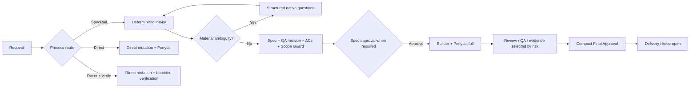

<div align="center">

# SpecRail

### Human-approved, evidence-backed software delivery for Codex and Pi

Choose the amount of process you want, remove material ambiguity before mutation, implement the smallest correct change, prove the result, and keep approval human-owned.

[](https://www.npmjs.com/package/@saulmarti/specrail)
[](https://nodejs.org/)
[](LICENSE)

</div>

> **Formerly AI Flow.** The `ai-flow` command and existing `.ai/` projects remain compatible.

## What changes about coding-agent delivery

SpecRail protects the expensive edges around code:

- **No automatic ceremony.** Every new delivery work item asks whether to use `SpecRail`, `Directo`, or `Directo + verificar`.
- **No silent assumptions.** Material intent must come from the user, an approved decision, or unique deterministic repository evidence; otherwise SpecRail asks.
- **Structured questions.** Clarifications use 2–4 concrete choices, at most one recommendation, and always allow free text.
- **Minimal implementation.** Production-code mutation uses official Ponytail in `full` mode unless the user explicitly disables it for the current work item.
- **Compact approvals.** The default review shows the decision, proof, risk/blocker, and primary evidence; full specification/evidence/history stays under Review Details.
- **Deterministic governance.** Specification hashes, Scope Guard, Acceptance Coverage, evidence, amendments, leases, phase boundaries, and final approval remain enforced mechanically.

## Install

Requirements: Node.js 22+, macOS/Linux, Codex or Pi, and CodeGraph for governed repository discovery. UI work may additionally use Taste Skills. Codex Visualize is optional.

### Managed Codex + Pi + terminal CLI

```bash
npm install -g @saulmarti/specrail@beta
specrail install
```

### Pi-native package

```bash
pi install npm:@saulmarti/specrail@beta
```

The Pi package includes its SpecRail adapter/skills and does not require a global `specrail` executable inside Pi. See [`docs/PI.md`](docs/PI.md).

Verify/repair a managed install:

```bash
specrail doctor
specrail doctor --fix
```

`doctor --fix` never silently installs external tools or plugins.

## New-task entry gate

Ask naturally:

```text
Redesign the homepage hero so the primary action is clearer on mobile.
```

Before SpecRail creates task state or starts CodeGraph, a new delivery work item asks:

1. **SpecRail** — governed, traced workflow.
2. **Directo** — execute the prompt without SpecRail workflow state.
3. **Directo + verificar** — execute directly, then run the smallest meaningful verification.
4. **Other…** — write your own answer.

No route is preselected. This choice is independent of the internal Control Profile (`micro`, `light`, `standard`, `rigorous`) and autonomy (`Guided`, `Autonomous`, `Headless`).

Explicit prefixes skip only the redundant entry question:

```text
SpecRail Fast: cambia el padding de esta card.       # governed Fast route
Sin SpecRail: corrige este typo.                     # Direct
No SpecRail: corrige este typo.                      # Direct
Directo + verificar: corrige este handler.           # Direct + bounded verification
Continue TASK-0042                                   # continue existing SpecRail task
```

`SpecRail Fast:` remains governed and may deterministically escalate if refinement reveals material risk. Direct routes create no SpecRail task, CodeGraph preflight, gates, evidence state, or learning state.

## No-Assumption Gate

A material decision is resolved only by:

1. explicit active user input;
2. an approved SpecRail decision;
3. an authoritative repository contract;
4. one unique established repository pattern;
5. current deterministic tool evidence.

Model confidence is not authority. If two plausible material interpretations remain, mutation stops and SpecRail asks. If the repository already proves a fact uniquely, SpecRail does not waste a question on it.

This applies to SpecRail, Direct, and Direct+Verify. Headless execution stops instead of inventing a human answer.

## Structured questions

Every clarification is compact:

```text
Persistencia
¿Qué backend debe conservar las sesiones?

A · SQLite        — local y simple (recommended)
B · Postgres      — estado compartido
C · JSON files    — sin base de datos
Other…
```

Rules:

- 2–4 genuinely different choices;
- at most one recommendation;
- recommendation is never consent;
- free text always available for clarification;
- up to four independent questions can be batched;
- dependent questions are asked sequentially.

Codex uses native `request_user_input`. Pi prefers a compatible attested richer question provider when available and otherwise uses SpecRail's native `ctx.ui` fallback. No third-party question package is silently installed.

## Ponytail by default for code mutation

Every production-code writing path—SpecRail, Direct, or Direct+Verify—requires the official Ponytail capability in `full` mode unless explicitly disabled for that work item.

The implementation order is:

```text
need it?
  → reuse existing code
  → standard library
  → native platform
  → existing dependency
  → minimum correct new code
```

Before a mutation phase completes, `ponytail-review` checks the current diff for unnecessary code/abstractions.

Ponytail never outranks explicit user requirements, security/privacy, accessibility, data-loss protection, approved scope, acceptance criteria, or evidence requirements. SpecRail never impersonates Ponytail or installs it silently.

## Governed SpecRail flow

When the user selects **SpecRail**:



The deterministic Control Profile prevents a copy/color fix from receiving the same burden as a critical migration:

| Profile | Typical governed depth |
| --- | --- |
| `micro` | exact bounded spec → Builder → real proof → final approval |
| `light` | focused Before → bounded implementation/QA → final approval |
| `standard` | normal product/design/review/QA controls |
| `rigorous` | full independent/risk-selected controls |

See [`docs/CONTROL-PROFILES.md`](docs/CONTROL-PROFILES.md).

## Approval without information overload

Approval uses a compact Decision Capsule:

```text
READY FOR FINAL APPROVAL

Outcome   Session persistence uses SQLite
Scope     6 scoped files
Proof     AC 8/8 · tests PASS · scope clean
Risk      none

[primary evidence]

Approve / Request changes / Keep open
```

The full Review Bundle is still authoritative and available on demand. Specification, AC/NFR detail, files, evidence inventory, logs, trace, repair history, Product Owner/Target Audience output, experiments, and amendments are collapsed by default.

The HTML Review Cockpit remains read-only. Actual approval always happens through the host-native, session-bound SpecRail interaction. See [`docs/REVIEW-COCKPIT.md`](docs/REVIEW-COCKPIT.md).

## Core guarantees

### Immutable approved specification

Approval stores a SHA-256 over governed scope, criteria, design/architecture decisions, dependencies, route, and QA mission. A governed change invalidates approval unless handled through an explicit Amendment.

### Acceptance Coverage

Observable criteria receive stable `AC-*` IDs and final approval requires real evidence for the effective criteria.

```bash
specrail acceptance coverage TASK-0042
```

See [`docs/ACCEPTANCE-COVERAGE.md`](docs/ACCEPTANCE-COVERAGE.md).

### Scope Guard

Implementation is checked against the approved blast radius, including untracked files. Required out-of-scope work stops for an Amendment instead of silently widening scope.

```bash
specrail scope status TASK-0042
```

See [`docs/SCOPE-GUARD.md`](docs/SCOPE-GUARD.md).

### Explicit Amendments

Post-approval governed changes preserve original approval history and extend the effective specification explicitly.

```bash
specrail amendment list TASK-0042
```

See [`docs/AMENDMENTS.md`](docs/AMENDMENTS.md).

### Incremental revisions

Bounded feedback on an already-visible result stays on the same task as `REV-*`, invalidates only affected artifacts, and does not replay the whole workflow. Small revisions are implement-first; permanent new tests are considered after the desired behavior stabilizes.

See [`docs/REVISIONS.md`](docs/REVISIONS.md).

### Explicit user governance overrides

A clear user instruction to close anyway or skip a waivable workflow step is recorded once as an immutable override. SpecRail does not loop forever on the same waived gate and never pretends the skipped evidence passed.

See [`docs/USER-GOVERNANCE-OVERRIDES.md`](docs/USER-GOVERNANCE-OVERRIDES.md).

### Human judgment stays human

Guided, Autonomous, and Headless control which mechanically safe steps can continue without interruption. They never authorize guessing unresolved product judgment. Headless stops when a real user decision is required.

See [`docs/AUTONOMY.md`](docs/AUTONOMY.md).

### Persistent project Product Owner + Target Audience

SpecRail can retain project-level product context and use Product Owner/Target Audience specialists where the active Control Profile requires them. Their opinions inform the gate; they do not replace user approval.

See [`docs/PRODUCT-OWNER.md`](docs/PRODUCT-OWNER.md) and [`docs/TARGET-AUDIENCE.md`](docs/TARGET-AUDIENCE.md).

### Host-neutral workflow, host-native interactions

Core task state and governance stay host-neutral. Codex and Pi adapters provide only host identity, native questions, presentation, model/thinking ownership, and fresh-session transitions.

See [`docs/PI.md`](docs/PI.md), [`docs/HOST-CAPABILITIES.md`](docs/HOST-CAPABILITIES.md), and [`docs/PHASE-BOUNDARIES.md`](docs/PHASE-BOUNDARIES.md).

## Useful CLI diagnostics

Users normally do not need CLI commands inside the coding-agent host. For diagnostics/automation:

```bash
specrail next TASK-0042
specrail readiness TASK-0042
specrail why-blocked TASK-0042
specrail status TASK-0042
specrail review cockpit TASK-0042
```

`next` is routing authority; readiness/why-blocked explain state but never replace it.

## Validation

Release-level validation:

```bash
npm install
npm run release:check
```

The suite covers TypeScript build, deterministic contracts, routing, Control Profiles, revisions, Pi adapter behavior, presentation integrity, Scope Guard, Acceptance Coverage, packaging, and installed E2E behavior.

## Security / privacy

SpecRail stores structured traces, evidence, task state, and metrics locally. It does not need an external workflow database or telemetry service. Host/model selection remains owned by the coding-agent host.

## Documentation

Start with the focused document for the subsystem you need:

- [`docs/PI.md`](docs/PI.md) — Pi-native installation and host mapping
- [`docs/CONTROL-PROFILES.md`](docs/CONTROL-PROFILES.md) — proportional governance
- [`docs/REVIEW-COCKPIT.md`](docs/REVIEW-COCKPIT.md) — compact approval/presentation integrity
- [`docs/ACCEPTANCE-COVERAGE.md`](docs/ACCEPTANCE-COVERAGE.md) — AC/evidence coverage
- [`docs/SCOPE-GUARD.md`](docs/SCOPE-GUARD.md) — implementation boundary
- [`docs/AMENDMENTS.md`](docs/AMENDMENTS.md) — governed post-approval change
- [`docs/REVISIONS.md`](docs/REVISIONS.md) — bounded implementation iteration
- [`docs/AUTONOMY.md`](docs/AUTONOMY.md) — Guided/Autonomous/Headless
- [`docs/PHASE-BOUNDARIES.md`](docs/PHASE-BOUNDARIES.md) — context/session boundaries
- [`docs/DOCTOR.md`](docs/DOCTOR.md) — installation repair
- [`docs/TRUST-MODEL.md`](docs/TRUST-MODEL.md) — trust and integrity boundaries

## License

MIT. See [`LICENSE`](LICENSE).
