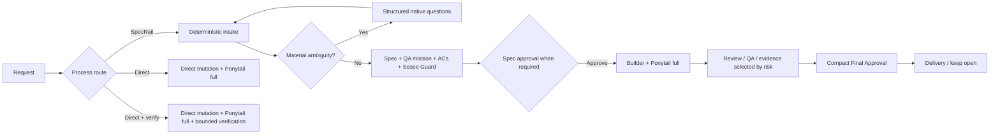

<div align="center">

# SpecRail

### Human-approved, evidence-backed software delivery for Codex and Pi

Turn a natural-language request into a bounded implementation, real evidence, and an explicit delivery decision while choosing how much process each work item needs.

[](https://www.npmjs.com/package/@saulmarti/specrail)
[](https://nodejs.org/)
[](LICENSE)

</div>

> **Formerly AI Flow.** The `ai-flow` command and existing `.ai/` projects remain compatible.

## Use it naturally

Open a repository in Codex or Pi and ask naturally. Commands are internal and optional.

```text
Implementa la tarea de persistencia de sesiones.
Corrige el bug del login.
Rediseña el hero de la homepage para móvil.
```

For every **new** delivery work item, SpecRail first asks which route to use:

1. **SpecRail** — governed, traced workflow.
2. **Directo** — execute without SpecRail workflow state.
3. **Directo + verificar** — direct execution plus the smallest meaningful verification.
4. **Other…** — free text.

No route is preselected. The process route is independent of Control Profile (`micro`, `light`, `standard`, `rigorous`) and autonomy (`Guided`, `Autonomous`, `Headless`).

Explicit prefixes skip only the redundant entry question:

```text
SpecRail Fast: cambia el padding de esta card.
Sin SpecRail: corrige este typo.
No SpecRail: corrige este typo.
Directo + verificar: corrige este handler.
Continue TASK-0042
```

`SpecRail Fast:` is still governed and may deterministically escalate. Direct routes create no SpecRail task, CodeGraph preflight, gates, evidence state, or learning state.

## Continue a task in another chat

Task references are stable as `TASK-#### — Title`. Continue by ID, exact title, or a unique descriptive phrase; SpecRail resolves the existing task instead of creating duplicate intake.

```text
Continue TASK-0042
Retoma la tarea de la homepage
Implementa la tarea de persistencia que aprobamos antes
```

Delivery remains explicit. Typical final choices include **Fusionar localmente**, **Confirmar entrega externa**, or keep the task open when delivery has not happened yet.

## Install

Requirements: Node.js 22+, macOS/Linux, Codex or Pi, and CodeGraph for governed repository discovery. Codex Visualize is optional.

### Managed Codex + Pi + terminal CLI

```bash
npm install -g @saulmarti/specrail@beta
specrail install
```

One-shot installation is also supported:

```bash
npx --package=@saulmarti/specrail@beta specrail install
```

### Pi-native package

```bash
pi install npm:@saulmarti/specrail@beta
```

No global SpecRail CLI required inside Pi: the package includes its adapter, runtime gates, and skills. See [`docs/PI.md`](docs/PI.md).

Verify or repair a managed install:

```bash
specrail doctor
specrail doctor --fix
```

`doctor --fix` never silently installs external tools or plugins.

## No-Assumption Gate

A material decision is resolved only by explicit active user input, an approved SpecRail decision, an authoritative repository contract, one unique established repository pattern, or current deterministic tool evidence.

Model confidence is not authority. If multiple material interpretations remain, mutation stops and SpecRail asks. If the repository proves a fact uniquely, SpecRail does not waste a question on it. Headless execution stops instead of inventing a human answer.

## Structured questions

Clarifications use 2–4 genuinely different choices, at most one recommendation, and always allow `Other`/free text. Recommendations are never consent. Up to four independent questions can be batched; dependent questions are sequential.

Codex uses native `request_user_input`. Pi prefers an attested richer question capability when available and otherwise uses the SpecRail adapter fallback. No third-party question package is silently installed.

## Ponytail is mandatory for production-code mutation

Every production-code writing path—SpecRail, Direct, or Direct+Verify—requires the official Ponytail capability in **`full`** mode before mutation. If it is missing, off, lite, imitated, or otherwise unattested, mutation blocks and SpecRail tells the user how to enable/install the official capability. There is no per-work-item Ponytail bypass.

Implementation follows the smallest-correct-change order:

```text
need it?
  → reuse existing code
  → standard library
  → native platform
  → existing dependency
  → minimum correct new code
```

Before a mutation phase completes, official `ponytail-review` checks the current diff. Ponytail never outranks explicit user requirements, security/privacy, accessibility, data-loss protection, approved scope, acceptance criteria, or evidence requirements. SpecRail never impersonates Ponytail or installs it silently.

## Governed SpecRail flow



The deterministic Control Profile keeps tiny changes cheap while retaining hard safety/evidence gates where needed. See [`docs/CONTROL-PROFILES.md`](docs/CONTROL-PROFILES.md).

## Approval without information overload

The approval control is capsule-first:

```text
READY FOR FINAL APPROVAL

Outcome   Session persistence uses SQLite
Scope     6 scoped files
Proof     AC 8/8 · tests PASS · scope clean
Risk      none

Approve / Request changes / Keep open
```

The complete authoritative Review Bundle remains attached as **Review Details** instead of being dumped into normal chat. The compact Review Cockpit is read-only; generated HTML is not proof the host opened or displayed it. Actual approval always uses the host-native, session-bound SpecRail selector.

Required canonical images must be shown in the conversation. On Codex, a signed plan may additionally invoke the exact `$visualize` skill for a richer review surface. `$visualize` never substitutes for required evidence or human approval, and prepared HTML/reference state is not proof of host presentation. See [`docs/REVIEW-COCKPIT.md`](docs/REVIEW-COCKPIT.md).

## CodeGraph lifecycle

SpecRail owns CodeGraph lifecycle during governed work. Healthy state inside the TTL launches no CodeGraph subprocesses. Normal task routing uses the cached contract/health state and the active host transport.

Do not manually run `codegraph init`, `sync`, `status`, or `index` during healthy task routing. Full reindex is never an automatic fallback; a full rebuild is reserved for explicit Doctor recovery. `SpecRail Fast` micro/light may defer project-wide CodeGraph until escalation requires it.

## Core guarantees

### Immutable approved specification

Approval stores a SHA-256 over governed scope, criteria, design/architecture decisions, dependencies, route, and QA mission. Governed changes invalidate approval unless handled through an explicit Amendment.

### Acceptance Coverage

Observable criteria receive stable `AC-*` IDs and final approval requires canonical evidence for the effective criteria. See [`docs/ACCEPTANCE-COVERAGE.md`](docs/ACCEPTANCE-COVERAGE.md).

### Scope Guard

Implementation is checked against the approved blast radius, including untracked files. Required out-of-scope work stops for an Amendment instead of silently widening scope. See [`docs/SCOPE-GUARD.md`](docs/SCOPE-GUARD.md).

### Incremental revisions

Bounded feedback on an already-visible result stays on the same task as `REV-*`, invalidates only affected artifacts, and does not replay the whole workflow. Small revisions are implement-first; permanent new tests are considered after desired behavior stabilizes. See [`docs/REVISIONS.md`](docs/REVISIONS.md).

### Explicit user governance overrides

A clear instruction to close anyway or skip a **waivable SpecRail workflow step** is recorded once as an immutable governance override. It never disables Ponytail or pretends skipped evidence passed. See [`docs/USER-GOVERNANCE-OVERRIDES.md`](docs/USER-GOVERNANCE-OVERRIDES.md).

### Human judgment stays human

Guided, Autonomous, and Headless control which mechanically safe steps continue without interruption. They never authorize guessing unresolved product judgment. See [`docs/AUTONOMY.md`](docs/AUTONOMY.md).

### Host-neutral workflow, host-native interactions

Core task state and governance stay host-neutral. Codex and Pi adapters provide host identity, native questions, presentation, model/thinking ownership, and fresh-session transitions. See [`docs/PI.md`](docs/PI.md) and [`docs/TRUST-MODEL.md`](docs/TRUST-MODEL.md).

## Useful CLI diagnostics

Users normally do not need CLI commands inside the coding-agent host. For diagnostics/automation:

```bash
specrail next TASK-0042
specrail readiness TASK-0042
specrail why-blocked TASK-0042
specrail status TASK-0042
specrail review cockpit TASK-0042
```

`next` is routing authority; readiness/why-blocked explain state but never replace it.

## Validation

```bash
npm install
npm run release:check
```

The suite covers TypeScript build, deterministic contracts, routing, Control Profiles, revisions, Pi adapter/runtime gates, presentation integrity, Scope Guard, Acceptance Coverage, packaging, and installed E2E behavior.

## Security / privacy

SpecRail stores structured traces, evidence, task state, and metrics locally. It does not need an external workflow database or telemetry service. Host/model selection remains owned by the coding-agent host.

## Documentation

- [`docs/PI.md`](docs/PI.md) — Pi-native installation and host mapping
- [`docs/CONTROL-PROFILES.md`](docs/CONTROL-PROFILES.md) — proportional governance
- [`docs/REVIEW-COCKPIT.md`](docs/REVIEW-COCKPIT.md) — compact approval and presentation integrity
- [`docs/ACCEPTANCE-COVERAGE.md`](docs/ACCEPTANCE-COVERAGE.md) — AC/evidence coverage
- [`docs/SCOPE-GUARD.md`](docs/SCOPE-GUARD.md) — implementation boundary
- [`docs/AMENDMENTS.md`](docs/AMENDMENTS.md) — governed post-approval change
- [`docs/REVISIONS.md`](docs/REVISIONS.md) — bounded implementation iteration
- [`docs/AUTONOMY.md`](docs/AUTONOMY.md) — Guided/Autonomous/Headless
- [`docs/DOCTOR.md`](docs/DOCTOR.md) — installation repair
- [`docs/TRUST-MODEL.md`](docs/TRUST-MODEL.md) — trust and integrity boundaries

## License

MIT. See [`LICENSE`](LICENSE).
