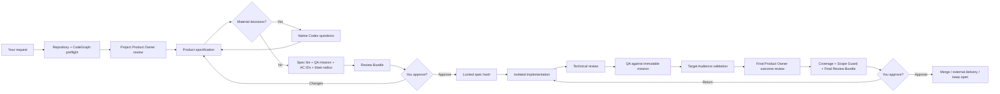

<div align="center">

# SpecRail

### Human-approved, evidence-backed software delivery for Codex

Turn a natural-language request into a locked specification, focused implementation, real evidence, independent review, and an explicit delivery decision — without managing a board or memorizing commands.

[](https://www.npmjs.com/package/@saulmarti/specrail)
[](https://nodejs.org/)
[](LICENSE)

</div>

> **Formerly AI Flow.** The `ai-flow` command and existing `.ai/` projects remain compatible.

## Why SpecRail?

Coding agents are fast at producing code. The expensive failures happen around the code:

- implementing before the requirement is clear;
- silently changing the approved scope;
- reviewing a UI proposal that does not show the requested section;
- claiming success without real screenshots, responses, logs, or tests;
- retrying the same failure indefinitely;
- losing task state when a chat closes;
- letting two sessions edit the same task;
- babysitting mechanical approvals that do not require human judgment;
- spawning parallel agents without proving their scopes, leases, or host capability are safe;
- shipping something that passes QA but is unclear or low-value to the intended audience;
- approving a result from fragmented evidence.

SpecRail adds **rails**, not another project-management system. Markdown remains the source of truth, Codex remains the agent, and deterministic gates protect the delivery.

## 60-second setup

### Requirements

- macOS or Linux
- Node.js 22+
- Codex Desktop or another compatible Codex surface
- [CodeGraph](https://github.com/colbymchenry/codegraph) available as a CLI and configured as `codegraph serve --mcp`
- For UI work: compatible [Taste Skills](https://github.com/Leonxlnx/taste-skill)
- Optional: the Codex Visualize plugin/skill for native interactive review surfaces

### Install the beta

```bash
npm install -g @saulmarti/specrail@beta
specrail install
```

The current public channel is `beta`; stable releases will later use the default `latest` tag. The exact source-tree release number is canonical in `package.json`; the README intentionally follows the dist-tag instead of hard-coding a version that can drift.

The npm package is **`@saulmarti/specrail`**. The installed CLI command remains **`specrail`**; npm package scopes do not become part of executable names. The legacy `ai-flow` executable remains available as a compatibility alias.

To run it without a global install, use the explicit package form:

```bash
npx --package=@saulmarti/specrail@beta specrail install
```


Restart Codex Desktop. Open a repository in Codex and ask naturally:

```text
Redesign the homepage hero so the primary action is clearer on mobile.
```

```text
Corrige el bug que duplica favoritos al pulsar dos veces.
```

```text
Design the architecture for moving search indexing out of the request path.
```

You do not need to create tasks manually, mention SpecRail, invoke a skill, or remember an ID.

### Verify or repair the installation

```bash
specrail doctor
specrail doctor --fix              # preview safe repairs
# after the native approval gate:
specrail doctor --fix --apply safe
```

`doctor --fix` never silently installs Node, Git, CodeGraph, plugins, or rewrites an unknown MCP schema. See [`docs/DOCTOR.md`](docs/DOCTOR.md).

SpecRail maintains CodeGraph deterministically before agent reasoning:

```text
codegraph init PROJECT --index       # first use
codegraph sync PROJECT               # normal refresh
codegraph index PROJECT --force --quiet  # recovery
codegraph status PROJECT             # verified readiness
```

## What happens after a request



The workflow adapts by surface, size, and risk. A small copy fix does not receive the same verification burden as a critical migration.

## A concrete UI example

You ask:

```text
Fix the Home Spotlight heading. It is too dominant on mobile.
```

SpecRail requires Codex to:

1. identify the exact route and section;
2. launch the real application;
3. capture the focused section, not the top of the page;
4. select the appropriate Taste Skills by their installed frontmatter names;
5. use Image Gen for the visual proposal when design exploration is warranted;
6. review the proposal for target mismatch, overflow, clipping, overlap, readability, and design-system consistency;
7. show the specification, before image, design brief, proposal, and critique in chat;
8. wait for your approval;
9. implement in an isolated worktree;
10. capture the same target in the real application;
11. measure the final DOM/layout and compare before → proposal → after;
12. request final approval and delivery.

Image Gen is valid as a **proposal**. Only the real implemented application is valid as **final evidence**.

## A concrete backend example

You ask:

```text
Add a health endpoint for the monitoring system.
```

A valid specification must describe observable input, output, status codes, failure behavior, authorization and persistence when applicable. Final evidence can include:

```text
GET /health
HTTP/1.1 200 OK
{"status":"ok"}
```

along with the exact command, numeric exit code, tests, technical review, QA report, and operational logs/metrics when the risk policy requires them.

## Core guarantees

### The approved specification cannot drift

Approval stores a SHA-256 hash over governed scope, criteria, design, architecture, dependencies, route, and immutable QA mission. A later material edit invalidates approval automatically. Workflow logs and result evidence do not.

### Every approved requirement must be proven

Before approval, SpecRail assigns stable IDs such as `AC-001` to acceptance criteria. Evidence maps explicitly to those IDs, and the final gate requires 100% coverage of the effective specification. A conceptual `before` screenshot or Image Gen proposal cannot prove the final implemented outcome.

```bash
specrail acceptance coverage TASK-0042
```

See [`docs/ACCEPTANCE-COVERAGE.md`](docs/ACCEPTANCE-COVERAGE.md).

### Scope Guard keeps the agent inside the approved blast radius

Implementation tasks define allowed files/globs, protected files, and expected symbols before specification approval. The boundary is sealed to the approved baseline and checked against the real working tree, including untracked files.

```bash
specrail scope status TASK-0042
```

If the implementation genuinely needs another boundary, the agent must stop and propose a Change Request instead of silently widening scope. See [`docs/SCOPE-GUARD.md`](docs/SCOPE-GUARD.md).

### Post-approval changes are explicit Amendments

The approved base specification is never rewritten to hide implementation discoveries. A bounded Change Request can add acceptance criteria or blast-radius files while preserving the original approval hash and producing a new effective specification hash.

```bash
specrail amendment list TASK-0042
```

See [`docs/AMENDMENTS.md`](docs/AMENDMENTS.md).

### Small post-approval changes use an Incremental Revision Loop

When the user sees the implemented result and asks for a bounded refinement at any post-approval execution/review point, SpecRail keeps the same task and records an immutable `REV-*` instead of replaying planning or creating a new task. `REV-*` v3 derives its route from semantic change signals and a declarative artifact dependency graph: **revision context → provisional signals → Builder delta → actual changed files → final signals → invalidated artifacts → only their producer/validator phases → Final Approval**. Unaffected governed artifacts remain authoritative.

Revisions are deliberately **implement-first**. SpecRail does not require a new test plan or a speculative permanent test before implementing a small refinement whose desired result is still being discovered. After implementation it requires the cheapest direct evidence for the affected delta; existing tests may run when cheap and relevant, and permanent regression coverage is decided after the behavior stabilizes. Revision feedback also does not consume the repair budget.

At revision start SpecRail seals a lightweight workspace baseline. When Builder finishes, it compares that baseline with the real workspace delta and recalculates impact from the files actually changed; `classification` is descriptive only and never controls routing. If the actual delta reveals architecture/data/security/product/contract materiality, the fast path fails closed. Each Builder pass then advances an implementation generation (`GEN-*`). Implementation-dependent evidence is bound to that generation, so affected evidence from an older implementation cannot prove the new revision while unrelated evidence remains reusable.

```bash
specrail revision status TASK-0042
specrail revision list TASK-0042
```

Material architecture/data/security/product-flow/contract changes fail closed and must use an Amendment or return to the appropriate governed phase. See [`docs/REVISIONS.md`](docs/REVISIONS.md).

### Explicit user overrides do not loop on a gate

SpecRail remains fail-closed for agents and autonomy, but an explicit user instruction such as **“close this task anyway”** or **“skip final visual evidence”** is authoritative workflow input. SpecRail records an immutable `OVR-*` User Governance Override instead of repeatedly answering that formal closure is impossible. A terminal close marks the task as closed-with-override without pretending the skipped evidence/review passed; a named waiver makes `next`/Readiness stop surfacing that same step as a blocker.

Overrides require explicit current-turn user authorization and are never created autonomously. Ambiguous intent may be confirmed once; after explicit confirmation the override executes once. Separate worktree delivery is not silently merged when a task is force-closed.

```bash
specrail override list TASK-0042
specrail override waive TASK-0042 --step final-evidence --reason "User accepts without another capture" --user-authorized
# Waivable step names are derived from the workflow-gate registry; `design` and `technical-architecture` are supported too.
specrail override close TASK-0042 --reason "User explicitly requested closure" --user-authorized
```

See [`docs/USER-GOVERNANCE-OVERRIDES.md`](docs/USER-GOVERNANCE-OVERRIDES.md).

### Every task has an immutable QA mission

Before approval, Product Specifier defines:

- persona;
- starting point;
- goal;
- allowed public interface;
- success conditions;
- failure conditions.

QA must execute that exact mission and cite its approved hash. It cannot invent an easier test after seeing the implementation.

### Evidence must be real

SpecRail validates evidence contracts rather than trusting filenames:

- frontend: current `UI Target` contexts declared deterministically as `Route → Target → exact pixel Viewport(s) → Capture`, case-sensitive route/target identity, focused captures, proposal critique, and final layout audit;
- backend: executed request/response, command and exit code;
- architecture/database: editable source plus rendered diagrams and migration/rollback evidence;
- high-risk work: measurable property/mutation reports and operational logs, traces, or metrics.

For frontend tasks routed to browser QA, the `qa-report` records human and automated verification separately. A shell/terminal sandbox failing to reach `localhost` is not equivalent to the host Browser failing. `automatedVisualQA` must declare the capability (`hostBrowser`), structural surface class (`host-browser` or `host-without-browser`), whether Browser was actually attempted, result status, concrete host surface, and—after a real attempt—an invocation reference plus the served `http(s)` `targetUrl`. An attempted automated result is invalid with `verification.type=human`. Either `failed` or `unavailable` remains blocking when automated browser QA is required; human inspection never silently replaces it.

### Repairs are finite

Fast, standard, and rigorous profiles have explicit retry budgets. On the final failed attempt, SpecRail stops and presents what was tried, what still fails, evidence, alternatives, and a native user decision.

### One session owns execution

A lightweight atomic lease prevents two chats from implementing the same task simultaneously. Another chat can inspect, cancel, or explicitly take control.

### Product Intelligence checks value before and after implementation

New projects can require a persistent Project Product Owner before specification, a fresh-session Target Audience validation after QA, and a second Product Owner outcome review before final approval. These roles are integrity/freshness sealed and cannot silently override the user's intent: material product trade-offs remain human decisions. Existing projects keep their previous workflow until Product Intelligence is explicitly enabled.

### Autonomy changes authority, not quality gates

`Guided`, `Autonomous`, and `Headless` all use the same specification, Scope Guard, evidence, QA, Product Intelligence, and delivery contracts. Autonomous modes may cross only mechanically clean gates; questions, Amendments, product trade-offs, external delivery, and other human/external judgment are never fabricated. At normal implementation/review phase boundaries, Guided keeps the native boundary choice while Autonomous enters the deterministic same-session boundary when a stable session is available; Headless stops rather than guessing when the boundary cannot be entered safely.

### Parallel work is scheduled, leased, and host-attested

Multi-Agent Concurrency does not equate a graph of independent tasks with real parallel execution. SpecRail enforces project-wide `subagents.maxParallel`, dependencies, Scope Guard overlap, reservation-specific sessions, task leases, worktree isolation, interprocess locks, and transactional preparation. A host must attest real parallel subagent capability before `dispatch.mode: parallel`; otherwise SpecRail uses `serial-fallback`. Long-running lanes heartbeat their reservation, and an expired lease never authorizes silent redispatch.

### Reviews are mobile-friendly

At specification and final gates, SpecRail generates a durable local **Review Cockpit** and the authoritative Review Bundle, then marks canonical visual attachments as `requiredVisible`. A local path or generated HTML file is audit metadata, not proof that the user saw the evidence. Visual gates are now mechanically two-step: `next` first returns `interaction.tool=host_actions`; every canonical visual gets a blocking `present-image` action for the conversation and the Cockpit gets a non-blocking `open-url` action. Each real outcome is acknowledged against the exact task, gate, session, action ID and `presentationDigest`. Until the current digest is acknowledged, direct approve/change/reject commands are blocked and the native approval selector is not emitted. Changed evidence, another session, or a corrupt/stale acknowledgment returns the gate to presentation. If a required image cannot be presented in-conversation, approval stays blocked rather than degrading to paths. When the installed `visualize` skill is available, SpecRail can prepare and validate an interactive `$visualize` artifact plus native reference, but those states remain `hostPresentation: unverified` until the host exposes a trustworthy presentation signal.

## Autonomy Levels

SpecRail can run the same governed workflow at three authority levels:

```text
○ Guided      Review Product Owner opinion, spec, plan/result gates, and delivery.
● Autonomous  Interrupt only when judgment is required.
○ Headless    Stop only when SpecRail cannot safely proceed.
```

`Autonomous` and `Headless` may cross mechanically clean specification/final gates, but they never answer product questions, approve Amendments, resolve Product Owner/Audience trade-offs, steal a task lease, or invent external delivery confirmation. Local worktree merge can be automated only when the project explicitly configures it. See [`docs/AUTONOMY.md`](docs/AUTONOMY.md).

## Multi-Agent Concurrency

Large features can execute independent child tasks or vertical slices concurrently. `subagents.maxParallel` is enforced across the whole project, not separately per parent plan. SpecRail builds dependency-aware waves and only permits parallel Builder writes when both tasks have approved, current, non-overlapping Scope Guard boundaries. `prepare` atomically binds every selected lane — including Product Owner/specification/Target Audience task-local work — to a reservation-specific session **and** the normal task lease. Planned tasks reject unscheduled agent mutations, safe write lanes receive separate Git worktrees, possible scope overlap is serialized, long-running lanes renew the same reservation with `concurrency heartbeat` instead of becoming silently redispatchable on lease expiry, human gates and every role handoff yield the old lane, and synchronous partial `prepare` failures roll back newly created worktrees/leases before the wave is committed.

The scheduler is host-agnostic **without guessing host capability**. A host session must persist an integrity-checked capability attestation before `concurrency prepare` can return `dispatch.mode: parallel`; otherwise the default is `serial-fallback` and SpecRail reserves one lane only. The supported coordination contract is local-filesystem; unsupported distributed modes fail explicitly. Concurrency changes **when** a task runs, never its approvals, evidence, QA, Product Intelligence, leases, or Autonomy authority. See [`docs/MULTI-AGENT-CONCURRENCY.md`](docs/MULTI-AGENT-CONCURRENCY.md) and [`docs/TRUST-MODEL.md`](docs/TRUST-MODEL.md).

## Product Intelligence

Every new project gets a persistent **Project Product Owner** plus target-audience context. Existing projects remain on their previous workflow until Product Intelligence is explicitly enabled with `specrail product intelligence enable`, so an update cannot silently introduce new human gates. Before specification, the Product Owner challenges whether the requested feature serves the product, overlaps existing capability, or needs a consequential product decision. After QA, the **Target Audience Agent** validates whether intended users understand, discover, trust, and benefit from the real result; then the same Product Owner performs an outcome review (`ship` / `revise` / `do-not-ship`) before final approval.

In `Guided`, every current Product Owner opinion — including clean `build` and final `ship` — is shown for acknowledgement. In `Autonomous`/`Headless`, clean opinions may continue without interruption, while `revise` / `do-not-build` / `do-not-ship` and Target Audience product trade-offs remain human judgment gates. SpecRail never silently cancels or redefines the user's request. Project identity and audience profiles are bootstrapped before task-level Product Owner judgment. Both reviews are integrity-sealed and freshness-checked against their governed inputs; Target Audience freshness also includes the current implementation snapshot and evidence. Target Audience now has a **mandatory fresh-session boundary**: the prior QA/review session cannot enter, every additional primary persona rotates to another session, and the sealed audience packet excludes code/diff/architecture/QA internals. Audience refresh is transactional: invalid fresh input preserves the previous stale batch, while corrupted stale batches fail closed until explicit administrative reset. See [`docs/PRODUCT-INTELLIGENCE.md`](docs/PRODUCT-INTELLIGENCE.md).

## Prime-inspired execution model

SpecRail adopts the useful engineering separation described by Prime Intellect without pretending to be an RL training framework or sandbox provider:

| Layer | In SpecRail | Why it matters |
|---|---|---|
| **Taskset — what** | approved specification, acceptance criteria, QA mission, active regression evals, verification policy | the goal is independent from the agent strategy |
| **Harness — how** | specialist skills, gates, context budgets, repair policy, tools and actor | you can inspect which process produced the result |
| **Runtime — where** | repository, worktree, branch and process environment | evidence is tied to the execution environment |
| **Trace — what happened** | signed, parent-linked, branch-aware events | new chats, compaction and subagents remain auditable |

Every trace event carries digests for its taskset, harness and runtime, plus a parent hash and event hash. `specrail trace validate TASK-0001` detects modified or broken chains.

This produces the biggest value when tasks are long, multiple sessions/subagents are involved, failures become regression evals, or you want to compare delivery strategies. It adds little visible speed to a one-line CSS change — by design.

## Failure-to-eval learning loop

User rejections and failed reviews are classified locally. Repeated matching failures create an eval candidate:

```text
.ai/evals/candidates/EVAL-0003.md
```

Nothing becomes a permanent rule automatically. You approve or dismiss the candidate. Approved evals are loaded only into future matching phases and surfaces.

This turns recurring feedback such as “the screenshot shows the page top instead of the requested section” into a regression contract instead of another prompt paragraph.

## Context without repository-wide dumping

SpecRail starts with a small CodeGraph-guided context budget. Read-only expansions connected to the affected symbols may be automatic; broad, deep, write-capable, or unexplained expansions require approval.

Profiles control initial files, maximum files, graph depth, handoff size, repair limit, and quality depth:

```text
fast      small, low-risk delivery
standard  normal product work
rigorous  high-risk delivery
```

Full-repository scans are not the default.

## Clean phase handoffs without model configuration

SpecRail does **not** store a model configuration. The active model and reasoning setting are always whatever the user selected in Codex. SpecRail only separates phase context so planning can stay lean while implementation still starts with everything it needs.

```text
Planning / refinement
  bounded repository context
            ↓ specification approved
  SpecRail compiles implementation capsule
  and enforces a TURN boundary
            ↓
  next turn: same chat OR fresh chat
  user may keep or change Codex model
            ↓
Implementation
  executable capsule
  + canonical visual evidence
  + standard/rigorous CodeGraph context
            ↓
  strong/flexible review boundary
            ↓
Technical Review / QA / Final Customer
```

At the implementation boundary, `next.runtime.transitionNotice` explains that the compiled implementation capsule is ready, while `next.userInputRequired=true` and the top-level **approval selector** / `interaction` force an explicit native choice: **continue with the current Codex selector**, **pause to change model/reasoning in the real Codex selector**, or **open a fresh chat**. The selected choice is persisted into the signed boundary record before that turn ends. No option enters implementation in the approval turn. On the next `Continue TASK-0007`, `next.action=enter-phase-boundary` prevents the selector from being asked again; the boundary is entered first, then the compiled capsule becomes execution authority before generic repository Kanban/memory/process reads. A direct `boundary enter` before an explicit choice is rejected. SpecRail does not pretend to have a trusted Codex turn ID and never changes or stores the model. It can therefore enforce the choice→entry state machine mechanically, while the one-turn pause itself remains a host/skill contract until Codex exposes a trusted turn identifier.

If the stable session is unchanged SpecRail records `same-chat`; if a new Codex chat enters it records `fresh-chat`. The recommendation is contextual: small low-risk work can return `same-chat-ok`; normal, large, risky, or context-heavy work returns `fresh-chat-recommended`. Same-chat continuation preserves correctness through a logical authority reset, but it does not remove previous conversation tokens. Fresh-chat continuation gives both the logical reset and real context/token isolation. Preparing either boundary resets active CodeGraph file/symbol context even when the old and new phases happen to use the same context profile; the relevant prior seeds have already been compiled into the handoff.

The implementation handoff is a **compiled execution capsule**, not a prose summary. It explicitly states execution authority, required step order, effective ACs, Scope Guard, immutable QA Mission, UI target and approved proposal, canonical Before/Proposal/After evidence, implementation plan, architecture/decision constraints, CodeGraph seeds, Definition of Done, and exact stop/escalation conditions. Previous conversational reasoning is non-authoritative. A Builder should not reload the entire task unless the capsule says a section was truncated, a conflict needs source verification, or a concrete missing detail is required. This is deliberately designed so a less-capable implementation model can execute rather than reinterpret the plan.

You can inspect the boundary and estimate raw context savings without configuring a model:

```bash
specrail boundary status TASK-0007 --session my-session
specrail boundary estimate TASK-0007 --history-tokens 25000 --turns 6
```

The estimate is model-independent and uses a transparent UTF-8 chars/4 token heuristic. It measures only raw **prior-phase carryover**, assuming that prefix would otherwise remain in each measured turn. It is not Codex billing telemetry: host compaction/summarization, context-window behavior, prompt caching, and the selected model/provider can make actual token and monetary savings different.

SpecRail uses **phase-boundary handoffs**, not model-routed `spawn_agent`. If Codex later exposes a stable thread API, SpecRail may automate visible thread creation, but model selection remains entirely in the user's Codex selector.

## UI/UX and Taste Skills

SpecRail does not treat “Taste Skill” as one generic prompt. It validates and selects the installed skills by their official frontmatter names:

- `design-taste-frontend` — design direction and preflight;
- `gpt-taste` — stricter GPT/Codex variant;
- `redesign-existing-projects` — audit-first redesigns;
- `imagegen-frontend-web` / `imagegen-frontend-mobile` — visual references;
- `image-to-code` — implementation from an approved reference.

The route is contextual. Dashboard/data-table work should not blindly receive landing-page rules, and image-generation skills do not replace implementation skills.

## Visual explanations

When the current Codex skill catalog exposes the exact `visualize` skill, SpecRail can invoke `$visualize` for interactive:

- Visual Comparator v2: side-by-side, slider and overlay Before / Proposal / After review with viewport, route/target, and capture-scope filtering;
- mobile / desktop viewport toggles;
- option and consequence explorers;
- workflow timelines;
- request / response / error explorers;
- architecture and migration layer views.

It never assumes a tool name. The session records the exact discovered capability, signed plan, source digest, real invocation reference and quality evaluation. The Review Bundle mirrors the active canonical Comparator set first and moves superseded/out-of-scope frontend visuals into an explicitly historical audit subsection, so old captures cannot look like active proposals. For required Before/Proposal/After evidence, `outcome: rendered` means that SpecRail validated the generated comparator artifact and its native reference; it does **not** mean the host proved that the user saw it. Each canonical evidence ID must still be attached directly to an embedded `data:image/...;base64,...` `` in the Visualize fragment, while wrapper markers or local filesystem image URLs do not count. Frontend `visual-comparator-v2` plans additionally require Side by side, Slider, Overlay, filters, exact route+target+viewport+capture grouping, and review-role/context markers. Until a trustworthy host signal exists, `hostPresentation` stays `unverified` and the direct evidence + Cockpit-open fallback remains mandatory.

## Large features ship as vertical slices

A large feature cannot be planned only as “database, API, frontend.” SpecRail requires demonstrable user outcomes:

```text
Slice 1: A user creates a route and immediately sees it.
Slice 2: The user shares that route through a public link.
Slice 3: Another visitor opens the shared route.
```

Each slice contains its frontend/backend/data needs, acceptance criteria, evidence and dependencies. The dependency DAG is validated before child tasks are materialized.


## Review Cockpit — beta

Review Cockpit is implemented in `0.5.0-beta.2`. It turns the current task, Review Bundle, evidence, metrics, repair state, context budget, and signed trace into one generated, local, mobile-friendly HTML decision surface.

Generate it manually:

```bash
specrail cockpit TASK-0001
specrail cockpit TASK-0001 --stage spec
specrail cockpit TASK-0001 --stage final
```

At specification and final approval gates the local fallback is generated automatically. `$visualize` may prepare an interactive in-conversation review reference, but SpecRail never equates that with verified host display. The authoritative fallback always includes the complete Review Bundle, direct conversation presentation of every required canonical visual, and an explicit **Open Review Cockpit** browser action using the generated Cockpit `openUrl`. Visual gates expose those operations through `host_actions`; SpecRail records `presented`, `opened`, `offered`, `failed`, or `unavailable` against the current session and digest, and only emits the native approval interaction after all blocking presentation actions succeed. The Cockpit includes:

- overview of need, scope, out-of-scope boundaries and QA mission;
- stage-specific readiness checks and exact blocker explanations;
- Visual Comparator v2 with simultaneous side-by-side review, slider/overlay modes, viewport + route/target + capture-scope filtering, and explicit missing-evidence states;
- evidence inventory, repair budget, context usage, metrics and signed trace history;
- the latest Harness experiment, exact reported token usage, and adaptive recommendation when enough history exists;
- the available decision paths.

It is deliberately read-only. Approval still happens through Codex's native decision prompt so a stale HTML file cannot mutate task state. The Cockpit performs no network requests and embeds registered raster evidence locally. See [`docs/REVIEW-COCKPIT.md`](docs/REVIEW-COCKPIT.md).

## GitHub PR and CI delivery — deferred

This direction is documented for possible future team usage, but it has no current priority or target release:

```text
Issue → approved SpecRail task → branch/worktree → PR → CI → final review → merge
```

CI proves automated checks passed on a specific commit; it does not replace specification or final product approval. The PR will expose the approved outcome, QA mission, evidence state, CI results, and final Review Bundle, while SpecRail closes the task only after merge or confirmed external delivery. See [`docs/GITHUB-DELIVERY.md`](docs/GITHUB-DELIVERY.md).

## Public roadmap

The current 0.9.1 integration of Autonomy Levels, Product Intelligence, and Multi-Agent Concurrency is validated in [`docs/VALIDATION-0.9.1-AUTONOMY-CONCURRENCY-PRODUCT-INTELLIGENCE.md`](docs/VALIDATION-0.9.1-AUTONOMY-CONCURRENCY-PRODUCT-INTELLIGENCE.md).


### Readiness / Why blocked

CLI, `next`, and Review Cockpit now use the same deterministic gate model:

```bash
specrail readiness TASK-0042
specrail why-blocked TASK-0042
```

It reports exact failed or stale gates, who owns each blocker, and the shortest safe next action. The percentage is only `passed / applicable gates`, never an AI confidence score. See [`docs/READINESS.md`](docs/READINESS.md).

### Replay the same taskset against different harnesses

For workflow experiments, freeze one approved specification and immutable QA Mission, then execute different process profiles in isolated worktrees:

```bash
specrail replay create TASK-0042 --harness fast --compare standard,rigorous
specrail replay start REPLAY-... fast
specrail replay start REPLAY-... rigorous
specrail replay compare REPLAY-...
```

SpecRail compares only variants that passed the same acceptance and QA mission. It reports repairs, elapsed time, context use, tool calls, code-change size, and **exact input / cached-input / output token usage when the host reports it**. Missing usage remains unavailable; SpecRail never invents an estimate. Token count is used as a cost tie-breaker only when the compared variants identify the same model. See [`docs/REPLAY.md`](docs/REPLAY.md).

List a starter set of representative experiments:

```bash
specrail replay scenarios
```

The catalog includes micro UI changes, responsive bugs, backend validation, domain refactors, full-stack slices, data migrations, performance work, and cross-cutting changes. See [`docs/EXPERIMENTS.md`](docs/EXPERIMENTS.md).

### Adaptive Harness recommendation

After enough comparable local replays, ask SpecRail what the historical evidence supports:

```bash
specrail harness recommend TASK-0042
```

The recommendation is deterministic and advisory. It needs repeated comparable runs, protects the accepted/QA quality band before looking at cost, never recommends `fast` as the historical default for high/critical-risk work, and never changes `execution_profile` automatically. See [`docs/ADAPTIVE-POLICY.md`](docs/ADAPTIVE-POLICY.md).

The public roadmap now treats Readiness, safe Doctor repair, Replayable Tasksets, token-aware experiment comparison, and adaptive Harness recommendations as beta capabilities. Review Cockpit remains beta; GitHub delivery and Signed Delivery Bundle are deferred without a target release. See [`ROADMAP.md`](ROADMAP.md).

## Local project artifacts

```text
.ai/
├── config.json
├── project/
│   ├── product.md
│   ├── users.md
│   ├── architecture.md
│   ├── runbook.md
│   └── constitution.md
├── tasks/
├── evidence/
├── reviews/              # Review Bundles and generated Cockpit HTML
├── decisions/
├── evals/
│   ├── candidates/
│   └── active/
├── metrics/
└── runtime/
    ├── leases/
    ├── context/
    ├── failures/
    ├── repairs/
    └── traces/
```

Project knowledge stays with the repository. Global workflow roles remain installed once.

## Continue a task in another chat

State does not depend on conversation history:

```text
Continue TASK-0007.
```

```text
Implementa la tarea “Rediseñar la homepage principal”.
```

```text
Retoma la tarea de la homepage.
```

SpecRail resolves IDs, exact titles, unique phrases, or the only open task. Ambiguity produces a native Codex selector instead of a guess.

## Commands

Commands are internal and optional. Normal use is conversational; they exist for diagnostics and integrations:

```bash
specrail doctor
specrail update
specrail list
specrail status TASK-0001
specrail readiness TASK-0001 --json
specrail why-blocked TASK-0001 --json
specrail next TASK-0001 --json
specrail override list TASK-0001
specrail override waive TASK-0001 --step final-evidence --reason "..." --user-authorized
specrail override close TASK-0001 --reason "..." --user-authorized
specrail autonomy status TASK-0001
specrail autonomy set guided|autonomous|headless
specrail product intelligence status
specrail product owner status TASK-0001
specrail product owner final status TASK-0001
specrail audience profiles
specrail audience status TASK-0001
specrail concurrency plan PARENT-TASK
specrail concurrency status PARENT-TASK
specrail concurrency prepare PARENT-TASK --host-session HOST-SESSION
specrail concurrency heartbeat PARENT-TASK CHILD-TASK --session LANE-SESSION
specrail capability host status --session HOST-SESSION
specrail spec lint TASK-0001 --json
specrail review bundle TASK-0001 --stage final --json
specrail metrics TASK-0001 --json
specrail trace TASK-0001 --json
specrail trace validate TASK-0001 --json
specrail replay create TASK-0001 --harness fast --compare rigorous
specrail replay compare REPLAY-... --json
specrail doctor --fix
specrail plugin validate --plugin-root ~/.ai-flow
```

The legacy `ai-flow` command is retained as an alias.

After final approval, a worktree task offers the explicit delivery choices **Fusionar localmente**, **Confirmar entrega externa**, or keep the worktree open.

## Update

```bash
specrail update
```

`specrail update` keeps the current release channel automatically: beta installations stay on `beta`, while stable installations use `latest`. It updates the global npm package and then refreshes the managed Codex skills, launchers, configuration, and global instructions from the newly installed package.

Switch channels explicitly when needed:

```bash
specrail update --latest
specrail update --beta
```

Preview the update without network or filesystem changes:

```bash
specrail update --dry-run --json
```

The installer preserves existing `.ai/` projects and creates one-time `.ai-flow.bak` backups before changing Codex configuration or global instructions.

## Uninstall

SpecRail intentionally does not delete project task history. To remove the global installation:

```bash
rm -rf ~/.ai-flow
rm -f ~/.local/bin/specrail ~/.local/bin/ai-flow
rm -rf ~/.agents/skills/ai-flow*
rm -rf ~/.codex/skills/ai-flow*
```

Then remove the managed block between `<!-- AI-FLOW:BEGIN -->` and `<!-- AI-FLOW:END -->` in `~/.codex/AGENTS.md`. Restore `.ai-flow.bak` files only when you want to revert all installer changes.

## Privacy and security

- no remote database;
- no SpecRail account;
- no telemetry;
- task state, metrics, failures and traces stay inside the repository;
- CodeGraph remains your directly configured MCP;
- Visualize and other host plugins are optional and subject to their own permissions;
- SpecRail never asks you to paste npm passwords, OTPs or access tokens into an agent conversation.

## Publishing and contributing

See [`ROADMAP.md`](ROADMAP.md), [`AGENTS.md`](AGENTS.md), and [`docs/PUBLISHING.md`](docs/PUBLISHING.md) for the public plan, repository rules, npm release checklist, and trusted publishing setup.

Before publishing:

```bash
npm install
npm run check
npm pack --dry-run
```

## FAQ

### Is SpecRail a task board?

No. It is a delivery workflow. Markdown task artifacts and chat-native reviews replace a separate board UI.

### Does it replace Codex?

No. Codex reasons and uses tools; SpecRail controls state, gates, evidence and delivery invariants.

### Does it make every task slower?

Small tasks use a lighter route. Deterministic checks are cheap. The goal is lower **total time to accepted delivery**, not maximum code-generation speed.

### Is Prime Intellect code included?

No. SpecRail applies the taskset/harness/runtime/trace separation as an architectural idea. It does not include their runtime, training system or Verifiers SDK.

### Is Visualize required?

No. It is a supplementary host capability with Markdown and attachment fallback.

### Is this an official OpenAI product?

No. SpecRail is an independent, community-built workflow for Codex-compatible environments.

## License

MIT
